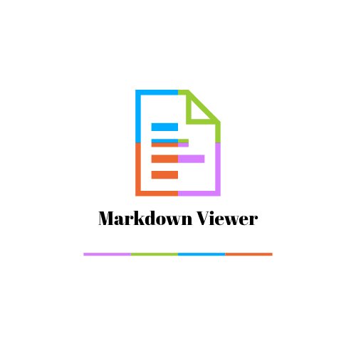

<div align="center">

# 🚀 MarkDown Viewer

### Elegant • Fast • Privacy-First Markdown Viewer

Render Markdown beautifully with GitHub Flavored Markdown, syntax highlighting, Mermaid diagrams, responsive layouts, and zero backend dependencies.

<p>
  
</p>


**🔗 [Try the live demo](https://manoj-maharana.github.io/markdown-viewer/)**

</div>

---

## ✨ Overview

**MarkDown Editor** is a modern Markdown Viewer designed for developers, technical writers, students, and documentation enthusiasts.

Simply open a Markdown file and enjoy a clean, responsive, GitHub-style reading experience with beautiful typography and code highlighting—all directly in your browser.

No installation.
No backend.
No tracking.

---

# ✨ Features

- 📄 GitHub Flavored Markdown (GFM)
- ⚡ Lightning-fast rendering
- 🎨 Beautiful typography
- 🌙 Clean modern interface
- 📦 Fully client-side
- 🔒 Privacy-first
- 💻 Syntax highlighting
- 📋 Tables
- ☑️ Task Lists
- 😊 Emoji support
- 📱 Responsive Design
- 🔗 Automatic link rendering
- 📝 Blockquotes
- 📌 Lists
- 📑 Headings
- 📦 Code Blocks
- 🖥️ Works in all modern browsers

---

# 📸 Preview

> Add your screenshots here.

```
images/
 ├── preview-light.png
 ├── preview-dark.png
 └── mobile-view.png
```

---

# 🚀 Getting Started

## Clone Repository

```bash
https://github.com/manoj-maharana/markdown-viewer.git
```

## Navigate

```bash
cd markeditor
```

## Open

Simply open

```
index.html
```

in your browser.

That's it.

No dependencies.

No installation.

👉 Or skip the setup and [try it live here](https://manoj-maharana.github.io/markdown-viewer/).

---

# 📂 Project Structure

```
MarkEditor/
│
├── index.html
├── logo.png
└── README.md
```

---

# 🧩 Supported Markdown

| Feature | Supported |
|----------|-----------|
| Headings | ✅ |
| Paragraphs | ✅ |
| Bold | ✅ |
| Italic | ✅ |
| Lists | ✅ |
| Tables | ✅ |
| Task Lists | ✅ |
| Code Blocks | ✅ |
| Inline Code | ✅ |
| Blockquotes | ✅ |
| Images | ✅ |
| Hyperlinks | ✅ |
| Horizontal Rules | ✅ |
| Emojis | ✅ |
| GitHub Flavored Markdown | ✅ |

---

# ⚡ Performance

- Instant Rendering
- Lightweight
- Zero Backend
- Fast Loading
- Optimized UI
- Responsive Layout

---

# 🔒 Privacy

MarkVista processes everything locally inside your browser.

- ✅ No server
- ✅ No uploads
- ✅ No tracking
- ✅ No analytics
- ✅ Your files never leave your computer

---

# 🌐 Browser Support

| Browser | Supported |
|-----------|-----------|
| Chrome | ✅ |
| Edge | ✅ |
| Firefox | ✅ |
| Safari | ✅ |
| Brave | ✅ |
| Opera | ✅ |

---

# 🎯 Use Cases

- README Preview
- Documentation
- Notes
- Knowledge Base
- Wiki Pages
- Technical Writing
- API Documentation
- Project Documentation
- Markdown Learning

---

# 🛠 Built With

- HTML5
- CSS3
- JavaScript
- Markdown

---

# 🚀 Roadmap

- [ ] Drag & Drop Support
- [ ] Dark Theme
- [ ] Print to PDF
- [ ] Export HTML
- [ ] Search
- [ ] Full Screen Mode
- [ ] Reading Mode
- [ ] Keyboard Shortcuts

---

# 🤝 Contributing

Contributions are always welcome!

1. Fork the repository
2. Create your feature branch

```bash
git checkout -b feature/amazing-feature
```

3. Commit your changes

```bash
git commit -m "feat: add amazing feature"
```

4. Push

```bash
git push origin feature/amazing-feature
```

5. Open a Pull Request

---

# ⭐ Show Your Support

If you found this project useful, consider giving it a ⭐ on GitHub.

It helps others discover the project.

---

# 📄 License

This project is licensed under the MIT License.

Feel free to use, modify, and distribute it.

---

<div align="center">

## ❤️ Built for the Developer Community

Made with passion to provide a clean, elegant, and lightning-fast Markdown viewing experience.

**Happy Coding! 🚀**

🔗 [Try the live demo](https://manoj-maharana.github.io/markdown-viewer/)

</div>
